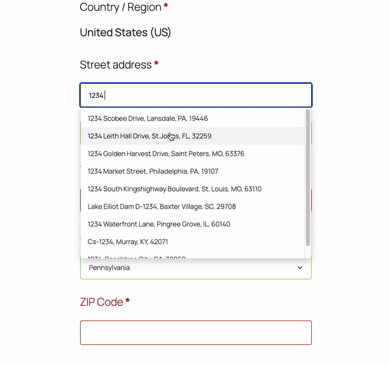

# WooCommerce US Address Autocomplete

A lightweight WordPress plugin that adds intelligent address autocomplete functionality to WooCommerce checkout pages for US addresses.

## Description

This plugin enhances the WooCommerce checkout experience by providing real-time address suggestions as customers type their shipping or billing address. It uses the Photon geocoding API to fetch accurate US address data and automatically populates city, state, and zip code fields based on the selected address.

## Demo



## Features

- **Real-time Address Suggestions**: As users type their address, they receive instant suggestions from a comprehensive US address database
- **Auto-fill Address Fields**: Automatically populates city, state, and zip code when an address is selected
- **Dual Address Support**: Works for both billing and shipping addresses on the checkout page
- **US-Focused**: Specifically optimized for United States addresses
- **Lightweight**: Minimal performance impact with efficient API calls
- **jQuery UI Integration**: Uses native jQuery UI autocomplete for seamless WordPress integration
- **Smart Filtering**: Only shows valid US addresses with complete information (city, state, and postcode)

## Requirements

- WordPress 5.0 or higher
- WooCommerce 3.0 or higher
- PHP 7.4 or higher
- jQuery and jQuery UI (included with WordPress)

## Installation

### Manual Installation

1. Download the plugin files
2. Upload the `woo-us-address-autocomplete` folder to the `/wp-content/plugins/` directory
3. Activate the plugin through the 'Plugins' menu in WordPress
4. The plugin will automatically work on your WooCommerce checkout page

### Via WordPress Admin

1. Go to Plugins > Add New
2. Click "Upload Plugin"
3. Choose the plugin zip file
4. Click "Install Now"
5. Activate the plugin

## Usage

Once activated, the plugin works automatically on the WooCommerce checkout page:

1. Navigate to your WooCommerce checkout page
2. Start typing an address in either the billing or shipping address field
3. After typing at least 3 characters, address suggestions will appear
4. Click on a suggestion to auto-fill the address, city, state, and zip code fields

## Technical Details

### Architecture

The plugin follows WordPress best practices with a clean, object-oriented architecture:

- **Namespace**: `JPJULIAO\Wordpress\WooUSAddressAutocomplete`
- **Singleton Pattern**: Uses a singleton pattern for the main Init class
- **Conditional Loading**: Scripts only load on checkout pages for optimal performance

### API Integration

- **Service**: Photon by Komoot (https://photon.komoot.io)
- **Features**: Free, open-source geocoding API based on OpenStreetMap data
- **Limits**: 50 suggestions per query
- **Language**: English (en)

### File Structure

```
woo-us-address-autocomplete/
├── assets/
│   ├── css/
│   │   └── style.css          # Autocomplete dropdown styling
│   ├── js/
│   │   └── script.js          # Frontend autocomplete logic
│   └── us-states.json         # US state name to code mapping
├── class-init.php             # Main plugin class
├── plugin.php                 # Plugin header and initialization
└── README.md                  # This file
```

### Hooks and Filters

The plugin uses the following WordPress hooks:

- `wp_enqueue_scripts`: Conditionally loads CSS and JavaScript on checkout pages

### JavaScript Dependencies

- jQuery (bundled with WordPress)
- jQuery UI Autocomplete (bundled with WordPress)

## Customization

### Styling

You can customize the autocomplete dropdown appearance by overriding the styles in your theme's CSS:

```css
.wc-address-autocomplete-dropdown {
    /* Your custom styles here */
}
```

### Minimum Characters

To change the minimum number of characters before suggestions appear, modify line 51 in `assets/js/script.js`:

```javascript
minLength: 3, // Change this value
```

### API Limit

To adjust the number of suggestions returned, modify line 34 in `assets/js/script.js`:

```javascript
url.searchParams.append('limit', 50); // Change this value
```

## Frequently Asked Questions

### Does this plugin work with other countries?

Currently, the plugin is optimized specifically for US addresses. While the Photon API supports international addresses, this plugin filters results to show only US addresses.

### Is there a cost to use this plugin?

No, the plugin is completely free. It uses the free Photon geocoding API service.

### Will this slow down my checkout page?

No, the plugin is designed to be lightweight. Scripts only load on the checkout page, and API calls are made only when users type in the address field.

### Can I use this with custom checkout fields?

The plugin currently targets the default WooCommerce billing and shipping address fields (`#billing_address_1` and `#shipping_address_1`). Custom implementations may require code modifications.

### Does this work with WooCommerce blocks?

This plugin is designed for the classic WooCommerce checkout. Compatibility with WooCommerce blocks may require additional development.

## Changelog

### 1.0.0
- Initial release
- Address autocomplete for billing and shipping addresses
- Integration with Photon geocoding API
- Auto-fill for city, state, and zip code fields
- US state name to code mapping

## Support

For bug reports, feature requests, or support questions, please contact:

**Author**: Juan Pablo Juliao  
**Plugin URI**: [Your Plugin URI]  
**Support Email**: [Your Email]

## License

This plugin is licensed under the GPL v2 or later.

```
WooCommerce US Address Autocomplete
Copyright (C) 2026 Juan Pablo Juliao

This program is free software; you can redistribute it and/or modify
it under the terms of the GNU General Public License as published by
the Free Software Foundation; either version 2 of the License, or
(at your option) any later version.

This program is distributed in the hope that it will be useful,
but WITHOUT ANY WARRANTY; without even the implied warranty of
MERCHANTABILITY or FITNESS FOR A PARTICULAR PURPOSE. See the
GNU General Public License for more details.

You should have received a copy of the GNU General Public License along
with this program; if not, write to the Free Software Foundation, Inc.,
51 Franklin Street, Fifth Floor, Boston, MA 02110-1301 USA.
```

## Credits

- **Geocoding API**: [Photon by Komoot](https://photon.komoot.io)
- **Address Data**: [OpenStreetMap](https://www.openstreetmap.org)
- **jQuery UI**: [jQuery Foundation](https://jqueryui.com)

## Privacy

This plugin makes API calls to the Photon geocoding service (https://photon.komoot.io) to fetch address suggestions. The address data entered by users is sent to this third-party service. Please review Photon's privacy policy and ensure compliance with your local privacy regulations (GDPR, CCPA, etc.).

## Contributing

Contributions are welcome! If you'd like to contribute to this plugin:

1. Fork the repository
2. Create a feature branch
3. Make your changes
4. Submit a pull request

## Roadmap

Potential future enhancements:

- [ ] Admin settings page for API configuration
- [ ] Support for additional countries
- [ ] Alternative geocoding API options
- [ ] WooCommerce blocks compatibility
- [ ] Address validation
- [ ] Caching for improved performance
- [ ] Custom field mapping options

---

**Note**: This plugin requires an active internet connection to fetch address suggestions from the Photon API.
